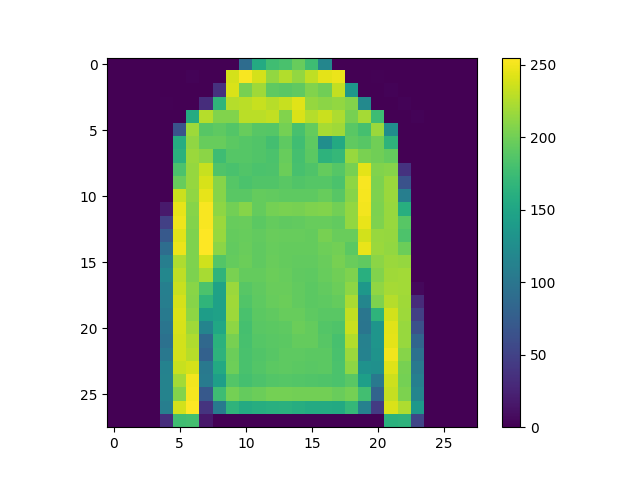
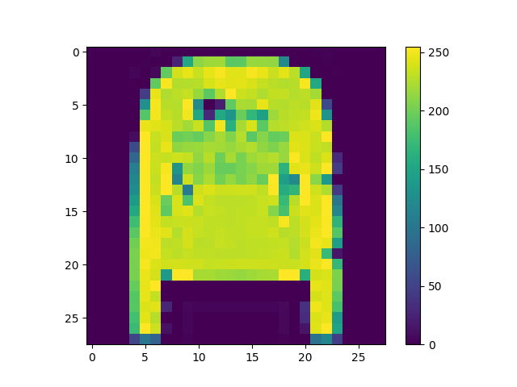
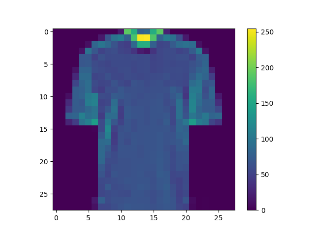
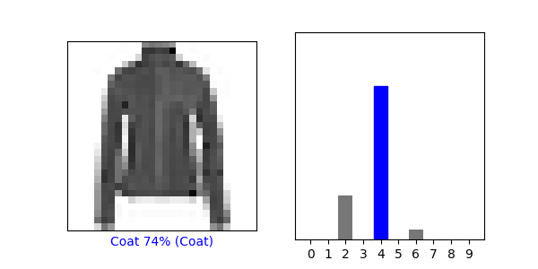
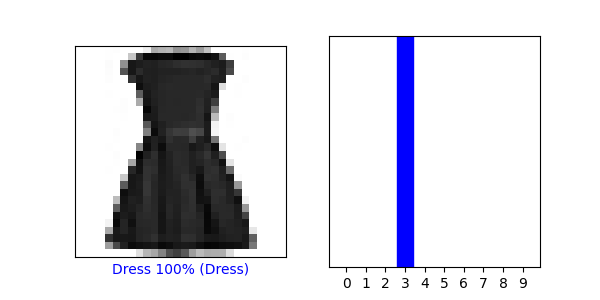

## Week 1

- Tuesday
  - What is the shape of the images training set (how many and the dimension of each)?
    - 60k images, 28x28 pixels each 
  - What is the length of the labels training set?
    - 10
  - What is the shape of the images test set?
    - 10k images, 28x28 pixels each
- Wednesday
  - Three new pictures: train_images[24, 11715, 59998]
    - 
    - 
    - 
  - Under the Make predictions section, present the array of predictions for an image from the test set other than the one given in the example script. What does this array represent? How were the Softmax() and argmax() functions applied? Read this post from DeepAI, "What is the Softmax function" for a description of the two functions (focus on the softmax formula, calculating softmax and the softmax vs. argmax sections). Does the output from np.argmax() match the label from your test_labels dataset?
    - predictions[726] = [1.3894646e-04 9.4496734e-08 2.4625491e-02 9.8963799e-05 2.9637107e-01
      3.5622022e-10 6.7874861e-01 5.5218738e-08 1.6696193e-05 2.5327507e-08]
    - The array represents how confident the model is that the image is one of the labels, represented as 0-9 in the array.
    - Softmax was used to assign each potential label a value corresponding to the model confidence such that adding them all up would be equal to 1. argmax looks at the array created by Softmax and picks the largest value to assign as a label to the image.
    - np.argmax(predictions[726]) = 6, this seems right though 4 is quite close.
  - Two verifications with graphs: predictions[1234, 5678]
    - 
    - 
  - Under the Use the trained model section, again select a new image from the test dataset. Produce the predictions for this newly selected image. Does the predicted value match the test label? Although you applied the argmax() function in this second instance, you did not use Softmax() a second time. Why is that so (please be specific)?
    - The predicted value matches the test value. We did not need to use Softmax a second time because the values in the array had already been converted into numbers between 0 and 1.
  - Evaluate how your model for the MNIST dataset compared with your model of the Fashion_MNIST dataset. Which of the two models is more accurate? Why do you think this is so?
    - The MNIST dataset is more accurate as 98% accuracy. This is because numbers are 2D, while clothing is 3D, so a number is more easily translated into pixels.
- Thursday
  - Worked with Maggie and Michael on the problem set [here](https://mkettelberger.github.io/data310/thurs1.html)